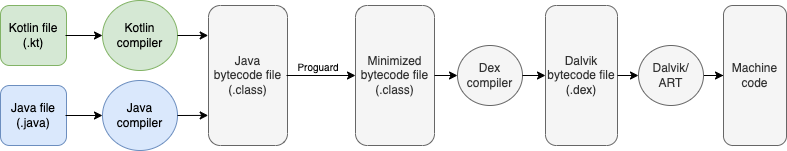
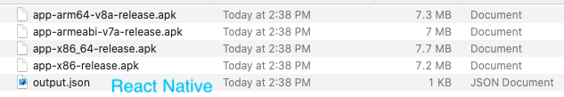

# Mobile app cross-platform, how it works

## Preamble
Have you ever wondered why
- Flutter and React Native (RN) can build apps for both Android and iOS.
- Supporting "hot reload" to quickly show affected code changes.
- Performance is still not as good as native.
- You’ve heard somewhere that says Flutter has performance close to native because Dart code is compiled to native code. On the other hand, React Native has less performance because it has to go through a bridge (which sometimes has bottlenecks).

To come clean, we're going through their architecture & compilation process.

Before starting, you can simply understand that the compilation (or interpretation) process will convert your programming language (e.g. Kotlin, Swift, Dart, JavaScript…), finally into executable machine code (which the CPU can execute).

> And for me, calling a language interpreted or compiled is not a well-defined concept. Technically it all matters depending on the implementation, not part of the language specification. Let read to the end of this article and you know why I said that.

We should go through native app (Android, iOS) compilation process to overview behind the scenes, then you’ll get about cross-platform (Flutter, React Native) easier.

## Android
Android can be written by Java or Kotlin, so the Android compilation process, in short, is based on Java/Kotlin compilation process.

- File .java or .kt is compiled by JAVAC (Java compiler)/Kotlin compiler -> Java byte code (file .class).
- With a normal Java app (e.g. run on Windows, Linux), there will be a JVM (Java virtual machine) converting these files to machine code and running by CPU.
- But with Android, this .class file will be minimized by proguard, then is compiled by Dex compiler -> Dex byte code (file .dex) -> .apk.
- When you launch (start up procedure) an Android app, file .dex will be converted to machine code by DVK/ART, and fed into memory, then executed by CPU.

DVK (Dalvik Virtual Machine) or ART (Android Runtime) is a virtual machine available on OS, to help you run Java bytecode on Android devices.

The difference between DVK vs ART is that ART (introduced from Android 4.4)  was built as a replacement for DVM because it uses AOT (Ahead Of Time) compilation, while DVM uses JIT (Just-In-Time). 
JIT compilation does the compilation during the execution of a program (every time you launch an app). While AOT compilation does the compilation when the app is installed -> this is key point ART makes an Android app startup faster than DVK.

You notice that, when installing the apk on the device, the app is still in bytecode, meaning the system has to take at least one step (with ART) to convert bytecode -> machine code.

## iOS
iOS compilation process, in short, based on Swift compilation process (actually there was some previous step with Xcode, but we won’t focus on this article).

The swift compiler has two dimensions: Frontend and Backend (and don’t think this is web client and server).

- Frontend: does lexical analysis, parsing and semantic analysis from frontend and passes rest of the phases to the backend.
- Backend: SwiftC (swift compiler) converts code to the form of AST (Abstract Syntax Tree) -> then goes through semantic analysis and is converted into Swift Intermediate Language (SIL).
- This code goes through analysis and is optimized along with LLVM IR (Intermediate Representation).
- Finally, LLVM converts them into assembly code and finally ends up in an executable file -> .ipa

LLVM (Low Level Virtual Machine) is a library for programmatically creating machine-native code.

iOS app is fully machine code when installed to the device, this is an advantage of iOS optimization compared to other platforms.

> From native's perspective, all React Native/Flutter screens just only take an Activity/View Controller. It means when you navigate between React Native/Flutter screens, you're moving inside React Native/Flutter's navigator, not `startActivity` or `pushViewController` in native code (conceivably it is similar in-app webview in this case).

## Flutter
Now it also supports web and desktop app, but in this article, we just focus on mobile apps (Android & iOS).

We know that developers can write Flutter apps by Dart, but Flutter compilation process will be a little bit different because not only Dart is compiled, but also C/C++ and more, why?

### First, let's overview architectural

You’ll see that Flutter has 3 layers that were written in different languages, and they will explain how a Flutter app works.

- Embedder is written in a language that is appropriate for the platform: currently Java and C++ for Android, Objective-C/Objective-C++ for iOS and macOS, and C++ for Windows and Linux. Embedder provides an entrypoint; coordinates with the underlying operating system for access to services like rendering surfaces, accessibility, and input; and manages the message event loop. 
- Engine, which is mostly written in C++ and supports the primitives necessary to support all Flutter applications. The engine is responsible for rasterizing composited scenes whenever a new frame needs to be painted. It provides the low-level implementation of Flutter’s core API, including graphics (through Skia), text layout, file and network I/O, accessibility support, plugin architecture, and a Dart runtime and compile toolchain.
- Framework, where most developers work, to build a Flutter app.

Different from React Native (which converts your JS component to native component), Flutter uses Skia (a graphic engine, recently Impeller) to render an entire UI widget by itself. So it means you can layout the same UI for both Android & iOS (including UX).
 
When comparing between Flutter/Skia and RN/native component, although I haven't done specific measurement statistics yet, but if you come to my articles [flutter-fb-reactions-animation](https://github.com/duytq94/flutter-fb-reactions-animation) & [react-native-fb-reactions-animation](https://github.com/duytq94/react-native-fb-reactions-animation), you can feel that Flutter brings to a smoother animation than RN.
 
This happen because React Native have to calculate animation value at JS thread then send to Native (UI) thread on every frame, if JS thread is blocked => drop frames => cause jank. Using useNativeDriver could help, it move all steps to native, but not support all cases.

How does hot reload work?
Because Dart support both JIT (debug mode) and AOT (release mode), so:
- When debugging, Flutter uses Dart VM with JIT mode, in short, it means that the developer can change the code at runtime, and only the new code that has been changed/inserted will be changed at the app, without the need to compile it again.
- When apps are ready to be deployed to production, the Dart ahead-of-time (AOT) compiler can compile to native ARM or x64 machine code. Your AOT-compiled app launches with consistent, short startup time.

This couldn’t happen in AOT languages (like Java/Kotlin on Android & Objective-C/Swift on iOS), since there’s no runtime environment to handle it.

Flutter compilation process basically means compile 3 layers we mentioned above, and will be different in Android and iOS.

### Compilation process
### Flutter Android
- The engine’s C and C++ code are compiled with Android’s NDK.
- The Dart code is ahead-of-time (AOT) compiled by Dart Compiler into native, ARM, and x86 libraries (most current android devices run on ARM, the latest x86 device is Asus zenfone 2 with intel Atom released 2015).
- Those libraries are included in a “runner” Android project, and the whole thing is built into an .apk.
- When launched, the app loads the Flutter library. Any rendering, input, or event handling, and so on, is delegated to the compiled Flutter and app code.

### Flutter iOS
- The engine’s C and C++ code are compiled with LLVM.
- The Dart code is ahead-of-time (AOT) compiled by Dart Compiler into a native, ARM library.
- That library is included in a “runner” iOS project, and the whole thing is built into an .ipa.
- When launched, the app loads the Flutter library. Any rendering, input or event handling, and so on, are delegated to the compiled Flutter and app code.

### Performance
- App built by Flutter not only includes your logic code (Dart) but also includes Embedder & Engine, so the app size will increase by around 5 MB compared to native (Android/iOS). Check the section [App size comparison](#app-size-comparison).
- Even though it's built into native code, Flutter still need engine (role as a bridge) when (and only, not all cases like RN bridge) handling task which connect with native API (camera, audio, sensor, etc.) through platform channels, and it's asynchronously.
- Using Skia to render UI, still cause [jank animation](https://docs.flutter.dev/perf/shader) at "first run" on iOS.

## React Native
### Overview architectural

- JSC (JavaScriptCore, also called JS engine, written in C++) is a framework that allows JavaScript code to be run on mobile devices. On iOS devices, this framework is directly provided by the OS while Android devices don't have it, so React Native needs to bundle it along with the Android app.
- React Native bridge (written in Java/C++) allows communication (by message, sent as a serialized JSON, asynchronous) between JS thread (where JS bundle - your logic code) and Native thread (Native UI/modules).
- Native (also called Main/UI) thread to handle UI rendering, user gestures, etc.
- Yoga (written in C/C++) is a cross-platform layout engine.

React Native components will be converted to native (Android/iOS) view, for example in some core components:

| RN component | Android view  | iOS view        |
| ------------ | ------------- | --------------- |
| `<Image>`    | `<ImageView>` | `<UIImageView>` |
| `<Text>`     | `<TextView>`  | `<UITextView>`  |
| ...          | ...           | ...             |

### Compilation process
- JS code will be packaged by Metro into a JS bundle.
- JSC, Yoga, React Native bridge will be packaged along with app.
- Generate APK/IPA.

JavaScript is an interpreted language, during debug mode, the JS code runs with Chrome (using V8 engine) instead of JSC, and communicates with native code via WebSocket. So it supports "hot reload" and allows us to see a lot of information on the Chrome debugging tools like network requests, console logs… 

React Native (JS code part) doesn’t be compiled to native code, every time an app launches, JSC will execute JS code, and communicate with native modules through React Native bridge (which causes some performance issues).

### Performance
- JavaScript is an interpreted language, need virtual machine/engine to intepret every launch app.
- All communication (render UI, using native modules, etc.) betwen JS and native depend on a bridge -> can cause bottlenecks, or JS thread is blocked cause UI thread jank.

But recently, React Native release new Hermes (from ver 0.64 for both Androd & iOS) & New Architecture (from ver 0.68):
- Hermes is a JavaScript engine (replacement for JSC) designed to optimize performance by reducing app launch time & precompiling JavaScript into efficient bytecode (meaning now Hermes compiles JS code -> bytecode at app building time) -> no more JIT (the answer to the question at the beginning of the article about defining a language as interpreted or compiled).
- New Architecture:
   - JSI (JavaScript interface) to replace The Bridge.
   - JSI can using any JS Engine instead of bridge only compatible with JSC.
   - Complete interoperability between all threads.
   - Lazy loading with Turbo Modules.

## App size comparison
These are the output of a **blank app** (I tested with their SDKs version around May 2020, and now maybe having a lot of improvements to optimize app size, but you can still refer to these figures for an overview).

### Android

Native has a small size because it contains only your logic code.

### Flutter

Flutter app has to package its engine & embedder along with your logic code.

Ignore app-x86-release.apk, which only has 487 KB because Flutter doesn’t support this CPU instruction set.

### React Native

React Native app has to package its bridge, JSC (only on android) along with your logic code.

You can see that libjsc.so take 3.2 MB.

And when optimizing with Hermes:

Hermes replaces JSC, more compact, and take only 808 KB.

### iOS
And an .ipa size before & after adding simple Flutter module

Cross-platform always needs more size than native (since they have to include engine, virtual machine, core framework, etc.).

_Willing if you have any contribution or discussion._
